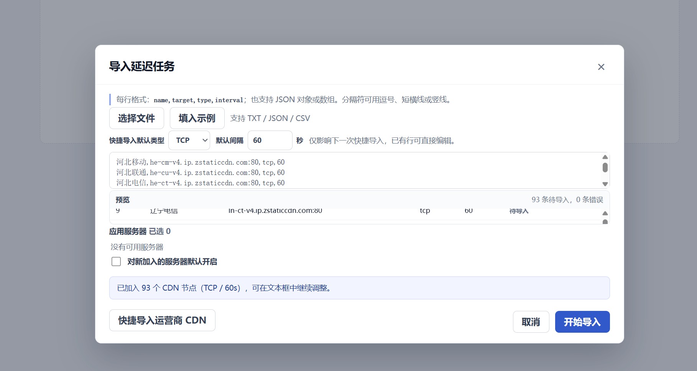

# Komari Ping Task Bulk

独立的 Komari 管理页面插件，提供延迟监测任务的批量删除、批量编辑和 TXT/CSV/JSON 导入。



## 功能

- 批量删除和批量编辑延迟监测任务
- 支持 TXT、CSV、JSON 和 JSON 数组导入
- 导入窗口支持省级、市级运营商 CDN 节点快照的搜索、多选和回填
- 支持手动调整导入任务的类型和默认间隔

CDN 节点快照来自 [`lf3-ips.zstaticcdn.com`](https://lf3-ips.zstaticcdn.com/)，当前快照日期为 2026-08-26。

## 安装

在 Komari 控制面板的插件管理页面上传 Release 中的 `ping-task-bulk.zip`。插件需要 Komari `>=1.4.3`，并使用当前管理员会话访问 `/api/admin/ping/*` 和 `/api/admin/client/list`。

## 开发

```bash
npm install
npm test
npm run build
```

发布 ZIP 时，必须将 `komari-plugin.json`、`script.js` 和构建生成的 `dist/` 放在 ZIP 根目录；不要把 `node_modules/` 放进 ZIP。

## 发布

GitHub Release 附件使用仓库根目录的 `ping-task-bulk.zip`。创建新版本前先运行测试和构建，并确保 ZIP 内只有一个根级 `komari-plugin.json`。
